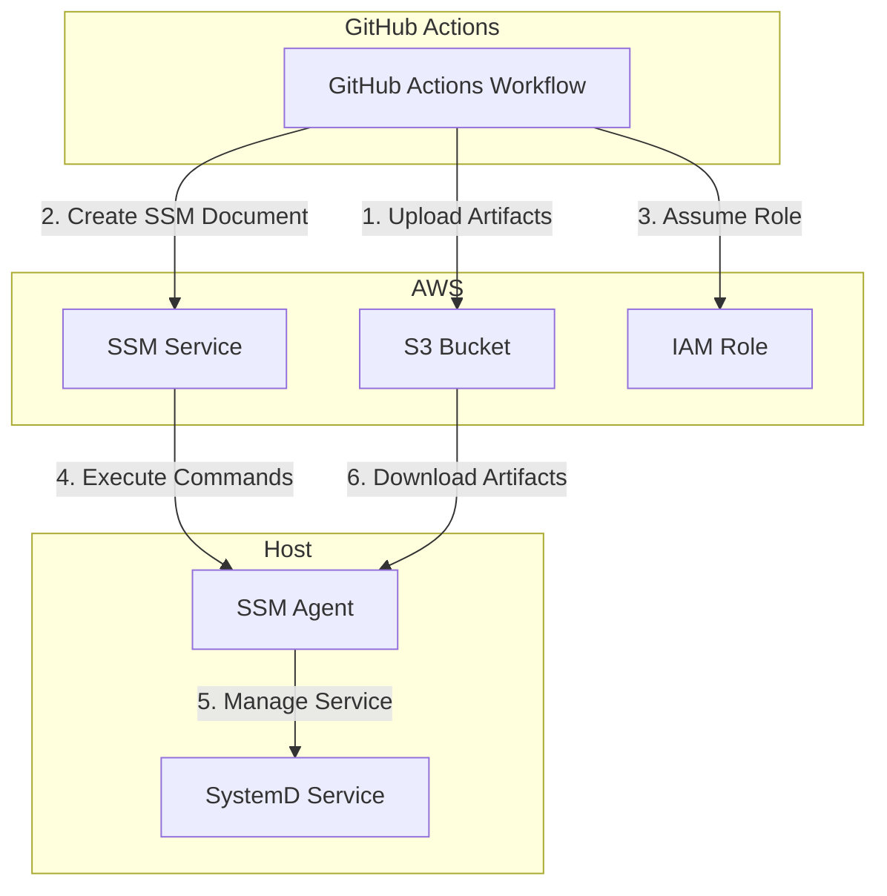
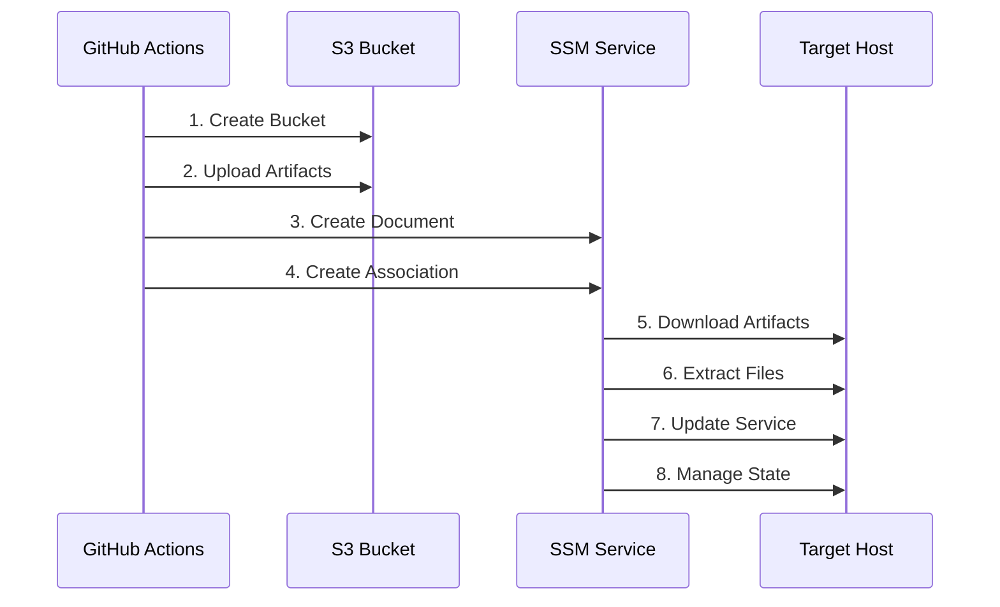

# Actions AWS Host Service

This GitHub Action deploys and manages systemd services on External Hosts or EC2 using AWS Systems Manager (SSM). It creates an SSM document and association to handle service deployment and management.

## Architecture



## Deployment Flow



## Features

- Deploy systemd services to EC2 instances
- Manage service state (enable/disable)
- Automatically handle service definition updates
- Target instances using AWS tags
- Secure artifact storage in S3

## Prerequisites

- AWS credentials with appropriate permissions
- EC2 instances with SSM agent installed
- Instances must be tagged appropriately for targeting

## Inputs

### Required Inputs

| Name | Description | Example |
|------|-------------|---------|
| `name` | Service name | `my-service` |
| `definition` | Service definition file path (relative to artifacts) | `my-service.service` |
| `targets` | Target selection criteria in format KEY:VALUE (one per line) | `Environment:DEV` |
| `artifacts` | Folder containing deployment artifacts | `resource/my-service` |

### Optional Inputs

| Name | Description | Default | Example |
|------|-------------|---------|---------|
| `status` | Service status (enabled/disabled) | `enabled` | `disabled` |
| `working-directory` | Where to extract artifacts on target instances | `/home/ssm-user` | `/opt/my-service` |
| `action` | Desired outcome: apply, plan or destroy | `apply` | `plan` |

## Outputs

| Name | Description |
|------|-------------|
| `bucket` | S3 bucket name for artifacts |
| `document` | SSM document ARN |

## Usage

```yaml
name: Deploy Service

on:
  push:
    branches: [ main ]

permissions:
  id-token: write
  contents: read

jobs:
  deploy:
    runs-on: ubuntu-latest
    
    steps:
    - uses: actions/checkout@v4

    - name: Configure AWS Credentials
      uses: aws-actions/configure-aws-credentials@v4
      with:
        role-to-assume: ${{ secrets.AWS_ROLE_ARN }}
        aws-region: us-east-1

    - name: Deploy Service
      uses: realsensesolutions/actions-aws-host-service@main
      with:
        name: my-service
        status: enabled
        working-directory: /opt/my-service
        definition: my-service.service
        artifacts: resource/my-service
        targets: |
          Environment:DEV
```

## How It Works

1. Creates an S3 bucket for storing service artifacts
2. Creates an SSM document with the service management commands
3. Sets up IAM roles and policies for SSM
4. Creates an SSM association targeting instances based on tags
5. Uploads and deploys the service artifacts
6. Manages the service state (enable/disable)

## Security

- Uses AWS IAM roles for secure access
- Artifacts are stored in a dedicated S3 bucket
- SSM provides secure command execution
- All resources are tagged with `provisioned-by: actions-aws-host-service`

## Development

### Local Testing

1. Set up AWS credentials
2. Run Terraform locally:
   ```bash
   terraform init
   terraform plan
   terraform apply
   ```

### Requirements

- Terraform 1.0+
- AWS CLI configured
- Appropriate AWS permissions

## License

[Add your license here]
